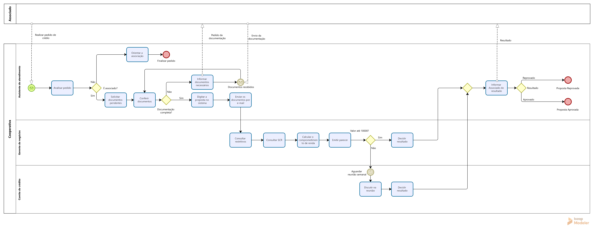
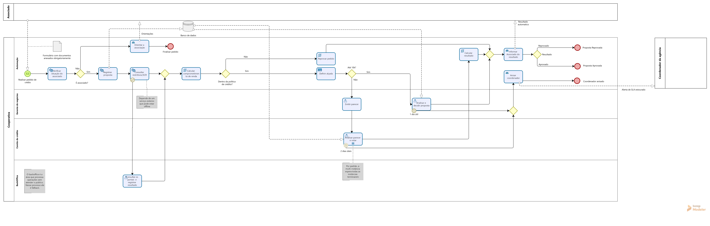
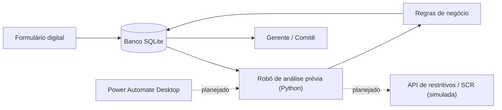
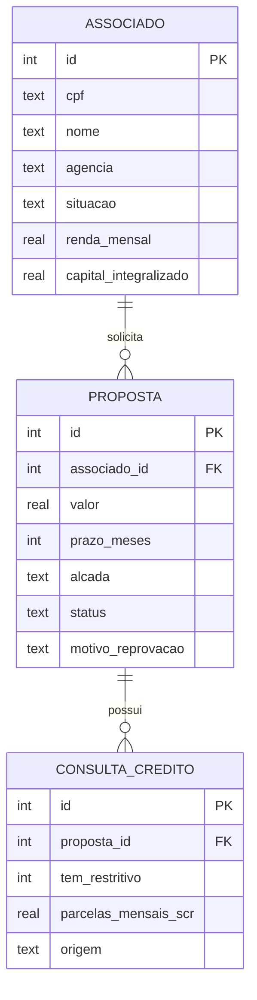

# Análise Prévia de Crédito: automação de processo de ponta a ponta


Projeto de estudo que simula, do levantamento de requisitos até o código, a automação do processo de **proposta de crédito pessoal** em uma **cooperativa de crédito fictícia**.

O objetivo é praticar o ciclo completo de uma equipe de automação de processos: **entender o processo atual, redesenhá-lo, modelar os dados e automatizar as etapas que não precisam de julgamento humano**.

---

## Sumário

- [O problema](#o-problema)
- [Processo atual (AS-IS)](#processo-atual-as-is)
- [Processo proposto (TO-BE)](#processo-proposto-to-be)
- [Arquitetura](#arquitetura)
- [Modelo de dados](#modelo-de-dados)
- [Regras de negócio](#regras-de-negócio)
- [Como executar](#como-executar)
- [Estrutura do projeto](#estrutura-do-projeto)
- [Decisões de projeto](#decisões-de-projeto)
- [Próximos passos](#próximos-passos)

---

## O problema

Na cooperativa fictícia, uma proposta de crédito pessoal levava em média **5 dias úteis**. As principais dores levantadas com a área de negócio:

| Dor | Causa raiz |
|---|---|
| Associado volta à agência várias vezes por falta de documento | Ele não sabe quais documentos levar antes da visita |
| Documentos sensíveis circulando por e-mail | Não existe um canal oficial para anexos |
| Gerente faz 3 consultas manuais a cada proposta | Consultas feitas por pessoa, em sistemas separados |
| Propostas acima da alçada esperam até 7 dias | O comitê de crédito decide só em reunião semanal |
| Ninguém sabe em que etapa está cada proposta | As etapas não são registradas |

---

## Processo atual (AS-IS)



Modelado no **Bizagi Modeler** em BPMN 2.0. Destaques: o retrabalho na conferência de documentos (loop com evento de mensagem) e a espera pela reunião semanal do comitê (evento de timer).

---

## Processo proposto (TO-BE)



| # | Requisito | Como o processo atende |
|---|---|---|
| R1 | Proposta entra por formulário digital | Evento de início de mensagem + objeto de dados |
| R2 | Documentos obrigatórios no envio | Validação no formulário (elimina o loop de retrabalho) |
| R3 | Análise prévia automática | Tarefas de serviço (consultas) e de script (cálculo) |
| R4 | Reprovação automática fora da política | Gateway "Dentro da política de crédito?" |
| R5 | Alçadas: até R$ 10 mil gerente; acima, comitê digital | Tarefa de regra de negócio + votação multi-instância |
| R6 | SLA: gerente 1 dia útil, comitê 2 dias úteis | Eventos de timer de borda **não interruptivos** |
| R7 | Falha na consulta não pode travar a proposta | Evento de erro de borda → fallback para o backoffice |
| R8 | Associado notificado automaticamente | Tarefa de envio + fluxo de mensagem |
| R9 | Rastreabilidade de cada etapa | Repositório de dados + registro de log |

---

## Arquitetura



O robô executa as tarefas da raia **Automação** do TO-BE. As regras de negócio ficam isoladas em funções puras, sem acesso a banco ou API, para que possam ser testadas separadamente.

---

## Modelo de dados



- Regras de validação ficam no próprio banco (`CHECK`, `NOT NULL`, `UNIQUE`, chaves estrangeiras).
- `consulta_credito.origem` distingue a consulta **automática** da **manual** (fallback do backoffice).
- `proposta.alcada` vazia (`NULL`) indica uma proposta reprovada automaticamente **antes** da etapa de alçada.

Exemplos de consultas de indicadores (taxa de aprovação, volume aprovado, uso do backoffice) estão em [`dados/consultas.sql`](dados/consultas.sql).

---

## Regras de negócio

| Regra | Valor |
|---|---|
| Comprometimento de renda | (parcelas existentes + parcela nova) ÷ renda |
| Limite de comprometimento | até 30% |
| Restritivo em birô de crédito | reprova automaticamente |
| Alçada do gerente | até R$ 10.000 |
| Acima de R$ 10.000 | comitê de crédito |

Implementadas em [`robo/regras.py`](robo/regras.py) e cobertas por testes em [`robo/test_regras.py`](robo/test_regras.py), incluindo os **casos de limite** (exatamente 30% e exatamente R$ 10.000).

---

## Como executar

Requisitos: **Python 3.13+** (sem bibliotecas externas até o momento).

```bash
# 1. Criar o banco com os dados fictícios
python dados/criar_banco.py

# 2. Rodar os testes das regras de negócio
python robo/test_regras.py

# 3. Listar as propostas que aguardam a análise prévia
python robo/ler_propostas.py
```

---

## Estrutura do projeto

```
├── bpmn/                  Diagramas AS-IS e TO-BE (Bizagi + PNG)
├── dados/
│   ├── schema.sql         Estrutura do banco
│   ├── seed.sql           Dados fictícios
│   ├── criar_banco.py     Recria o banco a partir dos scripts
│   └── consultas.sql      Consultas de indicadores
└── robo/
    ├── ler_propostas.py   Leitura das propostas pendentes
    ├── regras.py          Regras de negócio (funções puras)
    └── test_regras.py     Testes das regras
```

---

## Decisões de projeto

- **Associado como pool separado no BPMN:** ele é um participante externo, que não executa tarefas na plataforma. A interação é representada por fluxos de mensagem.
- **Backoffice como raia, e não como processo separado:** ele executa uma única etapa de contingência. Se o tratamento crescer ou for reutilizado por outros processos, a evolução natural é uma atividade de chamada.
- **Timer de SLA não interruptivo:** estourar o prazo avisa o coordenador, mas não cancela a análise do gerente.
- **O banco não é versionado:** o repositório guarda os scripts que o criam (`schema.sql` e `seed.sql`), e qualquer pessoa recria o banco com um comando.
- **Regras em funções puras:** a política de crédito fica num único arquivo, com os limites em constantes, e pode ser testada sem banco nem API.

---

## Próximos passos

- [x] Modelagem AS-IS e TO-BE em BPMN
- [x] Banco de dados e consultas de indicadores
- [x] Leitura das propostas pendentes
- [x] Regras de negócio com testes
- [ ] Consulta a uma API simulada, com novas tentativas e fallback para o backoffice
- [ ] Registro de log por etapa (rastreabilidade e SLA)
- [ ] Orquestração com Power Automate Desktop
- [ ] Painel de indicadores

---

## Autor

**Bernardo Garcia Ferrão**: [LinkedIn](https://www.linkedin.com/in/BernardoGFerrao) · [GitHub](https://github.com/BernardoGFerrao)
